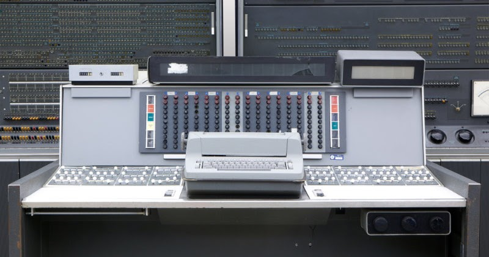
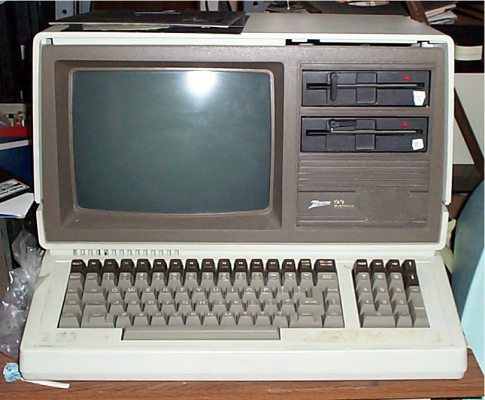
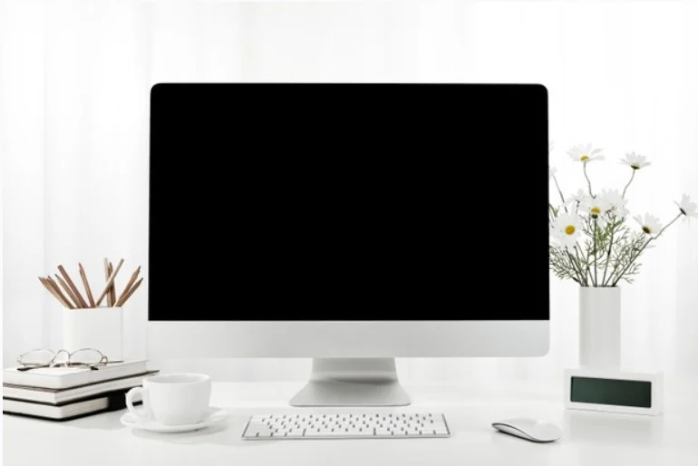

# TUGAS 1 SISTEM OPERASI #
Nama | Nim | Mata Kuliah | Dosen Pengampu
---|---|---|---
Adelia Erlyn N.C.P. | 2110131320010 | Sistem Operasi | Dr. Harja Santanapurba, M.Kom / Novan Alkaf B. S. S.Kom., M.T

<hr>
<br>

_**Deskripsi Tugas**_ <br>
```
1. Deskripsikan terkait benda-benda berikut yang ada pada PC/Laptop kalian, baik secara umum, spesifikasi, manfaat/kegunaan!
- PC/Laptop
- Sistem Operasi
- Prosessor
- Software
- Hardware
- Penyimpanan (Primer/Sekunder)

2. Eksplorasi sejarah pengembangan komputer!
```
<br>
<hr>
<br>

<u>_**Penyelesaian Tugas**_ </u><br>
<br>
<hr>

## Tugas 1 
<br>

<br><br>

> - ACER Aspire  A514-54
> - Windows 11
> - Processor	11th Gen Intel(R) Core(TM) i3-1115G4 @ 3.00GHz   3.00 GHz
> - Installed RAM	4,00 GB
> - 1 slot, DDR4, SSD, 1 Hard Drive(s), 2400 MHz, SSD tersedia, 512 GB, 8 GB RAM

<hr>
<br>

<hr>

## Tugas 2
<br>

<b><u><i><h2>Sejarah Perkembangan Komputer </h2></u></i></b>
<br>
I
Sejarah perkembangan komputer dari awal hingga sekarang setidaknya telah melalui lima generasi yang membuat teknologi komputer semakin maju. Banyak sekali pekerjaan yang dulunya kita temui jika dikerjakan secara manual agak merepotkan, kini pekerjaan dapat dengan mudah, secara otomatis dilakukan melalui perangkat melalui perangkat komputer. 
<br><br>

Sejarah asal mula komputer tidak jauh dari alat hitung. Pasalnya, komputer berasal dari bahasa Latin “computare” dan bahasa Inggris “to compute” yang sama-sama bermakna “menghitung”. Oleh sebab itu, penemuan alat hitung dijadikan sebagai salah satu tonggak sejarah komputer. Alat hitung yang menjadi cikal bakal komputer bernama abacus. Abacus adalah alat hitung kuno yang dipakai bangsa Romawi Kuno dan Yunani Kuno. Abacus dipakai dalam penghitungan sehari-hari layaknya kalkulator di masa sekarang.
<br>
<br>

<b><u><i><h2>Pengertian Komputer</h2></u></i></b>
<br>

Komputer dapat didefinisikan sebagai suatu peralatan elektronik yang terdiri atas beberapa komponen, yang dapat bekerja sama antara komponen satu dengan yang lain untuk menghasilkan suatu informasi berdasarkan program dan data yang ada. Konsep komponen-komponen komputer ini berasal dari arsitektur von Neumann, ketika John von Neumann memaparkan arsitekturnya pada 1945.
<br><br>

<b><u><i><h2>Awal Penemuan Komputer</h2></u></i></b>
<br>

Sekitar 30 tahun setelah Pascal menemukan kalkulator otomatis, matematikawan Jerman bernama Gottfried Wilhelm Leibniz mengembangkan kalkulator sebelumnya dengan menambahkan sistem bilangan biner. Sistem tersebut membantu mesin untuk menangani perhitungan lebih mudah ketimbang sistem desimal. Leibniz juga menambahkan roda gigi untuk perhitungan perkalian dan pembagian.
<br><br>

George Boole kemudian mengembangkan untuk matematika biner. Ilmuwan Inggris ini memakai sistem bilangan biner dalam menemukan tipe baru pada matematika yang kemudian dikenal dengan Aljabar Boolean dan Logika Boolean. Sementara itu, keberadaan komputer modern tidak lepas dari peran Charles Babbage. Matematikawan Inggris ini adalah penemu komputer pertama dengan karyanya Difference Engine No. 1. Ini adalah mesin penghitung dengan ukuran besar yang didesain pada tahun 1820-an. Alat ini adalah komputer mekanik yang mampu menjadi mesin penganalisa. Mesin ini adalah mesin pertama yang bisa diprogram oleh manusia. Sebagai apresiasi atas karyanya, Babbage dinobatkan sebagai “Bapak Komputer”. Sejarah perkembangan komputer hingga saat ini telah mengalami perluasan bentuk hingga menjadi portabel seperti laptop, dan memiliki kemampuan untuk digunakan berbagi tujuan.
<br><br>

<b><u><i><h2>Perkembangan Komputer dari Generasi 1-5</h2></u></i></b>
<br>

<br><br>


- <b>Komputer Generasi Pertama (1940-1959)</b>
<br><br>

<br><br>
<br><br>

> Generasi pertama dimulai ketika komputer digunakan dalam akademi dan militer, seperti Komputer Atanasoff-Berry dibuat pada tahun 1937 untuk menyelesaikan sistem persamaan linear dan komputer Colossus untuk memecahkan kode rahasia Jerman Nazi. Kemudian, ENIAC yang dibangun pada tahun 1946 menjadi komputer pertama untuk tujuan umum. Ketika komputernya dinyalakan untuk pertama kali, Philadelphia mengalami mati listrik. Komputer generasi ini menggunakan tabung vakum untuk menyimpan data dan ukurannya memakan satu ruangan.

> Ciri - ciri :
> - Program dibuat dalam bahasa mesin.
> - Menggunakan konsep storage program.
> - Komponen yang digunakan adalah tabung hampa udara.
> - Ukuran fisiknya besar, sehingga membutuhkan daya listrik yang besar.
> - Dapat disimpan di magnetic tape dan magnetic disk.
> - Contohnya komputer IBM 701 buatan tahun 1953 sebagai komputer komersial berukuran besar dan IBM 705 yang dibuat tahun 1959 untuk industri

<br>

<li>Komputer Generasi Kedua (1959-1965)</li>
<br>

<br><br>
<br><br>

> Generasi kedua dimulai ketika transistor menggatikan tabung vakum. UNIVAC diperkenalkan ke publik tahun 1951 untuk penggunaan komersial. Kemudian, pada tahun 1953, IBM memulai bisnis komputernya dengan merilis IBM 650 dan IBM 700. Berbagai bahasa pemrograman mulai dikembangkan dan komputer mulai memiliki memori dan sistem operasi.

> Ciri-ciri :
> - Kapasitas memori utama cukup besar.
> - Komponen yang digunakan adalah transistor yang jauh lebih kecil dibandingkan tabung hampa udara.
> - Menggunakan magnetic tape dan magnetic disk yang berbentuk removable disk.
> - Mempunyai kemampuan proses real-time dan time sharing.
> - Proses operasinya lebih cepat.
> - Orientasinya pada aplikasi bisnis dan teknik.
> - Contohnya komputer PDP-5 dan PDP-8 buatan tahun 1963 sebagai komputer mini komersial pertama. Selain itu ada pula komputer IBM 7070, IBM 1400, NCR 300, dan sebagainya.

<br>

<li>Komputer Generasi Ketiga (1965-1970)</li>
<br>

<br><br>
<br><br>

> Generasi ketiga dimulai ketika teknologi transistor meningkat menjadi sirkuit terpadu. Komputer mini adalah inovasi yang signifikan dalam generasi ini dan mempengaruhi generasi komputer selanjutnya. NASA menggunakan komputer generasi ini untuk melancarkan Program Apollo, seperti Komputer Bimbingan Apollo untuk mempermudah kendali Apollo Command/Service Module. Digital Equipment Corporation menjadi perusahaan komputer nomor dua di belakang IBM dengan komputer PDP dan VAX-nya. Komputer ini membawa ke pengembangan sistem operasi yang berpengaruh, Unix.

> Ciri-ciri :
> - Komponen yang dipakai adalah IV (Integrated Circuits) yang terdiri atas ratusan atau ribuan transistor berbentuk hybrid integrated circuits dan monolithic integrated circuits.
> -  Proses operasinya jauh lebih cepat dan lebih tepat, kapasitas memori komputer jauh lebih besar.
Ukuran fisik jauh lebih kecil sehingga penggunaan listrik lebih hemat.
> -  Menggunakan magnetic disk yang sifatnya random access.
> -  Dapat melakukan multiprocessing dan multiprogramming.
> -  Alat input-output mengalami pengembangan dengan menggunakan visual display terminal.
> -  Dapat melakukan komunikasi data dari satu komputer dengan komputer lainnya.
> -  Contohnya komputer IBM S/30. NOVA, CDC 3000, PDP-11, dan sebagainya.

<br>

<li>Komputer Generasi Keempat (dimulai dari tahun 1970)</li>
<br>

<br><br>
<br><br>

> Generasi keempat dimulai pada dasawarsa 1970-an ketika penemuan MOSFET dan integrasi berskala besar selanjutnya membawa ke pengembangan mikroprosesor di awal 1970-an. komputer pribadi yang semakin kecil berkat mikroprosesor mulai berkembang, dimulai dari komputer rumahan dan komputer meja. Teknologi selanjutnya adalah laptop dan ponsel cerdas yang sangat fenomenal, membawa berbagai perusahaan teknologi ke dalam perang paten atas ponsel cerdas.

> Ciri-ciri :
> - Penggunaan LSI (Large Scale Integration) yang disebut juga sebagai Bipolar Large Scale Integration.
> - Menggunakan mikroprosesor dan semikonduktor yang berbentuk chip untuk memori komputer.
> - Contohnya, komputer IBM 370 menggunakan Intel 4004 mikroprosesor yang dikembangkan pertama kali pada tahun 1971 oleh perusahaan Intel Corporation dengan menggunakan chip mikroprosesor.
> - Personal computer atau PC mulai berkembang sejak tahun 1977. Contohnya komputer pple II dan komputer dekstop oleh Xerox Corporation.
> - Pada tahun 1981, komputer mulai banyak menggunakan sistem Window dan mouse.

<br>

<li>Komputer Generasi Kelima</li>
<br>

<br><br>
<br><br>

> Generasi kelima digadang-gadang sebagai tahapan perkembangan teknologi paling canggih saat ini dan diciptakan pertama kali pada tahun 1980-an. Peningkatan dari segi visualisasi, menjadikan tampilan visual pada komputer di generasi kelima mempunyai resolusi sangat tinggi dan begitu tajam. Negara yang mempelopori sejarah perkembangan komputer pada generasi kelima adalah Jepang. Dalam proses pengembangannya, terdapat penambahan komponen-komponen penting ke dalam sistem komputer modern saat ini. Hal ini dikarenakan komponen yang digunakan pada komputer generasi kelima adalah menerapkan ragam teknologi modern, seperti superkonduktor, ULSI, dan kecerdasan buatan (atau kalian lebih mengenalnya dengan sebutan Artificial Intelligence).

> Ciri - ciri :
> - Komponen yang dipakai adalah VLSI (Very Large Scale Integration).
> - Kemampuan komputer dikembangakan untuk memecahkan masalah sendiri dengan bantuan AI (Artificial Intelligence). AI dapat diterapkan untuk mengoperasikan robot.
> - Mulai dikembangkan komputer yang dapat menggantikan chip.
> - Jepang adalah negara yang memelopori komputer generasi kelima.

<hr>
