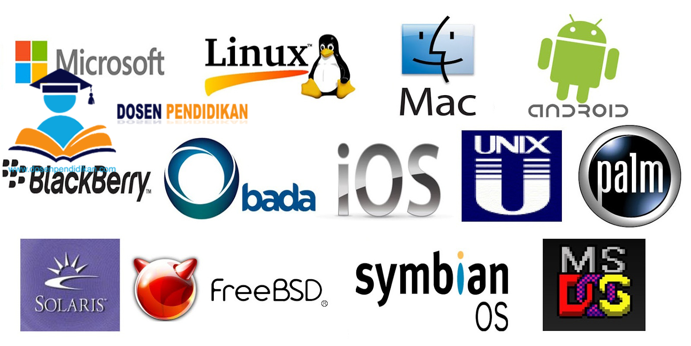
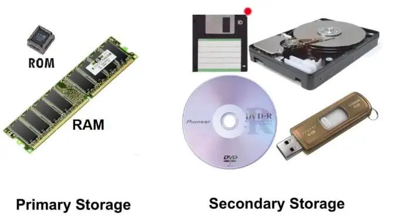

# TUGAS 1 SISTEM OPERASI #
Nama | Nim | Mata Kuliah | Dosen Pengampu
---|---|---|---
Adelia Erlyn N.C.P. | 2110131320010 | Sistem Operasi | Dr. Harja Santanapurba, M.Kom / Novan Alkaf B. S. S.Kom., M.T

<hr>
<br>

_**Deskripsi Tugas**_ <br>
```
1. Deskripsikan terkait benda-benda berikut yang ada pada PC/Laptop kalian, baik secara umum, spesifikasi, manfaat/kegunaan!
- PC/Laptop
- Sistem Operasi
- Prosessor
- Software
- Hardware
- Penyimpanan (Primer/Sekunder)

2. Eksplorasi sejarah pengembangan komputer!
```
<br>
<hr>
<br>

<u>_**Penyelesaian Tugas**_ </u><br>
<br>
<hr>

## Tugas 1 
<br>

<br><br>

> - ACER Aspire  A514-54
> - Windows 11
> - Processor	11th Gen Intel(R) Core(TM) i3-1115G4 @ 3.00GHz   3.00 GHz
> - Installed RAM	4,00 GB
> - 1 slot, DDR4, SSD, 1 Hard Drive(s), 2400 MHz, SSD tersedia, 512 GB, 8 GB RAM

<br>

### __PC/Laptop__
<br>

<br><br>

**Laptop** adalah komputer pribadi dengan bentuk kecil, ringan, flexible dan bisa dibawa kemana-mana. Laptop terdiri dari beberapa komponen yang mencakup casing, perangkat input output (keyboard, monitor, touchpad dll), motherboard, baterai dan juga perangkat lunak berupa sistem operasi dan aplikasi-aplikasi. Saya menggunakan laptop **ACER Aspire  A514-54**.
<br><br>

> **Kegunaan Laptop** :
> Laptop sangat berguna dalam kehidupan manusia karena telah memudahkan berbagai pekerjaan, contohnya seperti Mengetik dan Membuat Presentasi, Desain, Editing Foto dan Video, Alat komunikasi, Media Penyimpanan Data, dan masih banyak lagi kegunaan lainnya.

<br>

### __Sistem Operasi__
<br>

<br><br>

**Sistem operasi** adalah perangkat lunak yang paling penting untuk menjalankan komputer. Fungsinya umumnya adalah mengelola memori komputer dan proses-proses yang berjalan di komputer, serta semua perangkat lunak **(Software)** dan perangkat keras **(Hardware)**. __*Macam-macam Sistem Operasi*__ yaitu Linux, MS DOS, UNIX, Chrome OS, Windows, MacOS, Android, dll. Untuk laptop saya, saya menggunakan **Sistem Operasi Windows 11**.
<br><br>

Microsoft Windows atau yang lebih dikenal dengan sebutan Windows adalah keluarga sistem operasi yang dikembangkan oleh Microsoft, dengan menggunakan antarmuka pengguna grafis. Sistem operasi Windows telah berevolusi dari MS-DOS, sebuah sistem operasi yang berbasis modus teks dan command-line.

Microsoft berfokus pada tiga prinsip untuk memandu pemikiran kami guna membantu memastikan pengalaman pengguna yang luar biasa menggunakan Windows 11, yaitu :

- **Keandalan**
- **Keamanan**
- **Komtabilitas**

Berikut adalah persyaratan sistem minimum yang harus dipenuhi PC Anda untuk membantu mengaktifkan Windows 11: 

1. **Prosesor/CPU (Unit Pemrosesan Pusat)**: 1 Ghz atau lebih cepat dengan 2 atau lebih inti dan muncul dalam daftar CPU yang disetujui.
2. **RAM**: 4 GB.
3. **Storage**: 64 GB
4. **Firmware Sistem**: UEFI (for Unified Extensible Firmware Interface, a modern version of the PC ANALOG) and Secure Boot capable.
5. **TPM**: Trusted Platform Module (TPM) versi 2.0. 
6. **Kartu Grafis**: Kompatibel dengan DirectX 12 atau yang lebih baru dengan driver WDDM 2.0.
7. **Tampilan**: Tampilan Definisi tinggi (720p) yang lebih besar dari 9" secara diagonal, 8 bit per saluran warna. 
8. **Konektivitas Internet dan Akun Microsoft**: Windows 11 edisi Home memerlukan konektivitas internet dan Akun Microsoft untuk menyelesaikan penyiapan perangkat pada penggunaan pertama. 
9. **Windows Baru untuk Pemutakhiran**: Perangkat Anda harus menjalankan versi Windows 10 2004 atau yang lebih baru, untuk memutakhirkan melalui Windows Update.
<br><br>

> **Kegunaan Sistem Operasi** :
> Manajemen Sumber Daya Komputer, Berperan Sebagai Aplikasi Dasar Sebuah Perangkat, Menghubungkan Hardware, Mengoptimalkan Fungsi Sebuah Perangakat, Mengatur Sistem Kerja Perangkat.

<br>

### __Processor__
<br>

<br><br>

**Prosesor** adalah komponen utama atau otak dari laptop / komputer Anda. Prosesor terletak tepat di tengah _*motherboard*_. Prosesor merupakan <u>“otak”</U> di dalam sebuah komputer, bekerja menerima perintah dari pengguna, kemudian meneruskan ke hardware lainnya.  __*Macam-macam Processor*__ yaitu Intel, AMD (Advanced Micro Devices), IBM (International Bussiness Machines Corporation), Apple, IDT (Integrated Device Technology), dll. Laptop saya menggunakan **Processor Intel Core i3**.

Komponen Prosesor :
- **Control Unit (CU)**
- **Artimatics Logical Unit (ALU)**
- **Register Unit (RU)**

**Prosesor Intel Core i3** memiliki 2 prosesor dual core. Kedua prosesor tersebut dapat menjalankan 2 instruksi sekaligus dalam satu waktu. Kelebihannya, Core i3 lebih tahan terhadap panas serta lebih efisien daya.

Berikut beberapa poin penting dari Intel Core i3:
- Tidak support teknologi Hyper-Treading
- Turbo Boost dengan maksimum overclocking otomatis berkisar antara 2.933 GHz sampai dengan 3.2 GHz
- Clock Graphics Processor 100 MHz
- L3 Cache 4 MB
- LGA Socket 1156
- Core I3 dapat mengintegrasikan Virtualizing Tecnology dengan GPU (Graphic Processing Unit) sehingga berjalan lebih cepat
<br><br>

> **Kegunaan Processor** : Memastikan komputer bekerja dengan baik, Menjalankan proses informasi pada komputer, Memberikan perintah kepada tiap komponen komputer, Memberikan perintah kepada tiap komponen komputer, Menunjang kegiatan spesifik komputer, Mengolah perhitungan algoritma, Menjaga stabilitas komponen komputer, Mendukung kebutuhan spesifik komputer.

<br>

### __Software__
<br>

<br><br>

**Software** adalah data yang diprogram, disimpan, dan diformat secara digital dengan fungsi tertentu. Perangkat ini sendiri tidak memiliki bentuk fisik, Anda bisa mengoperasikannya lewat perangkat komputer. Untuk pembuatannya sendiri, perangkat ini memerlukan bahasa pemrograman yang ditulis oleh seorang pemrogram/orang yang ahli akan bidang tersebut. Selanjutnya, perangkat tersebut dikompilasikan memakai aplikasi kompiler agat dapat menjadi kode yang bisa dikenali oleh mesin _*hardware/ perangkat keras*_. Yang dimaksud hardware/perangkat keras disini adalah Personal Computer/komputer.

Beberapa fungsi utama dari software:
1. Dasar kebutuhan komputer agar dapat dioperasikan dengan baik.
2. Mengatur hardware/perangkat keras yang ada pada komputer. Dengan begitu, komputer yang digunakan dapat bekerja dengan baik sesuai pekerjaan apa yang dibutuhkan.
3. Penghubung antara beberapa software yang lain dengan hardware komputer.
4. Penerjemah perintah pada software lain yang ada dalam bahasa mesin. Dengan begitu, hardware pada komputer pun bisa mengerti dan menerimanya dengan baik.
5. Dapat digunakan dalam mengindentifikasi sebuah program di dalam komputer.

Pembagian software berdasarkan jenisnya :
- **Sistem Operasi (Operating System)**
- **Bahasa Pemrograman (Programming Language)**
- **Program Aplikasi**

<br>

### __Hardware__
<br>

<br><br>

**Hardware** adalah semua jenis komponen pada komputer yang memiliki bentuk fisik, bisa dilihat, dan dirasakan. Jadi, dapat dikatakan pengertian hardware adalah alat fisik komputer yang gunanya untuk melakukan beberapa proses seperti input, output, dan proses.

Ciri-ciri hardware :
- Memiliki bentuk fisik
- Umumnya bersifat keras
- Terdapat di bagian luar komputer
- Media penghubung antara user dan software

Fungsi Hardware :
- Memberi output
- Menerima input
- Menyimpan informasi dan data
- Mengolah informasi dan data

Jenis-jenis Hardware :
1. Hardware Output : Monitor, Printer, Speaker, dll.
2. Hardware Input : Mouse, Keyboard, Scanner, dll. 
3. Hardware Process : CPU, VGA, RAM, dll.
4. Storage Device : Hard disk, Flash disk, Optical disk.

3 instruksi dasar untuk menjalankan Hardware :
1. Instruksi dasar input, yaitu instruksi yang bisa memberikan informasi kepada perangkat lunak lainnya menggunakan perantara driver. Dalam hal ini perangkat lunak tersebut yaitu sistem operasi. Ini terjadi saat user menggunakan hardware, contohnya mengetik menggunakan keyboard atau mengklik dengan mouse.
2. Instruksi dasar proses, yaitu instruksi yang berperan untuk penengah antara proses input atau output. Instruksi ini hanya terjadi dalam suatu hardware, bukan sistem komputer secara menyeluruh.
3. Instruksi dasar output, yaitu instruksi yang terjadi saat ada perintah untuk menggunakan hardware tersebut dari pengguna.

<br>

### __Penyimpanan__
<br>

<br><br>

### __Penyimpanan Primer__
<br>

Penyimpanan primer atau bahasa kerenya __*Primary Storage*__ adalah sebuah media penyimpanan yang berfungsi untuk menyimpan data, _*Primary Storage*_ di sebut juga dengan **memori internal**, primary Storage biasanya memiliki kecepatan aksen yang lebih cepat dari pada _*Secondary Storage*_, selain itu primary Storage hanya memiliki kapasitas yang terbatas dan cenderung lebih kecil dari pada secondary Storage.

Contoh dari Primary Storage adalah seperti:
1. **RAM (Random Access Memory)**
2. **ROM (Read Only Memory)**

<br>

### __Penyimpanan Sekunder__
<br>

__*Secondary Storage*__ adalah sebuah media penyimpanan data secara permanen yang di simpan untuk melayani pemrosesan data yang di lakukan oleh CPU. _*Secondary storage (Non Volatile)*_ ini sama sekali tidak bergantung pada listrik seperti primary. Ketika listrik padam maka data yang terisimpan di dalam secondary storage akan tetap ada dan dapat kita akses ketika listrik menyala. Berbeda dengan _*Primary (Volatile)*_ yang ketika listrik pada maka data yang tersimpan di dalamnya akan terhapus.

Contoh dari Secondary Storage :
- **Hard disk**
- **Disket**
- **CD/DVD**

<br>

### __Perbedaan Penyimpanan Primer & Sekunder__
<br>

>Penyimpanan Primer | Penyimpanan Sekunder
>---|---
>Penyimpanan primer mengacu pada penyimpanan utama komputer atau memori utama yang merupakan memori akses acak atau RAM. | Penyimpanan sekunder di sisi lain, mengacu pada perangkat penyimpanan eksternal yang digunakan untuk menyimpan data secara jangka panjang.
>Penyimpanan primer menyimpan data atau aplikasi yang dapat langsung diakses oleh unit pemrosesan dengan minimum atau tanpa penundaan | Penyimpanan sekunder digunakan untuk menyimpan dan mengambil data secara permanen tanpa penundaan.
>Penyimpanan primer adalah memori yang tidak stabil yang berarti data hilang segera setelah perangkat kehilangan daya dan tidak dapat dipertahankan. | Penyimpanan sekunder, umumnya dikenal sebagai memori sekunder, adalah memori non-volatile yang mampu menyimpan data bahkan jika perangkat kehilangan daya.
>RAM adalah perangkat penyimpanan primer yang paling umum yang juga berjalan dengan memori utama dan digunakan untuk menyimpan kode mesin data yang sedang digunakan. | Penyimpanan sekunder mengacu pada perangkat penyimpanan eksternal seperti media optik (CD dan DVD), hard disk drive (HDD), floppy disk, USB flash drive, dll.
>Ketika program dan aplikasi disimpan dalam memori utama, penyimpanan primer memberikan akses cepat dan efisien ke CPU. | Penyimpanan sekunder lebih merupakan solusi penyimpanan jangka panjang dengan kapasitas penyimpanan data substansial yang membuatnya relatif lebih lambat daripada rekan-rekan utama mereka.


<hr>
<br>

<hr>

## Tugas 2
<br>

<b><u><i><h2>Sejarah Perkembangan Komputer </h2></u></i></b>
<br>

**Sejarah perkembangan komputer** dari awal hingga sekarang setidaknya telah melalui <u>lima generasi</u> yang membuat teknologi komputer semakin maju. Banyak sekali pekerjaan yang dulunya kita temui jika dikerjakan secara manual agak merepotkan, kini pekerjaan dapat dengan mudah, secara otomatis dilakukan melalui perangkat melalui perangkat komputer. 
<br><br>

Sejarah asal mula komputer tidak jauh dari alat hitung. Pasalnya, komputer berasal dari bahasa Latin _*“computare”*_ dan bahasa Inggris _*“to compute”*_ yang sama-sama bermakna __“menghitung”__. Oleh sebab itu, penemuan alat hitung dijadikan sebagai salah satu tonggak sejarah komputer. Alat hitung yang menjadi cikal bakal komputer bernama **abacus**. **Abacus** adalah alat hitung kuno yang dipakai bangsa Romawi Kuno dan Yunani Kuno. Abacus dipakai dalam penghitungan sehari-hari layaknya kalkulator di masa sekarang.
<br>
<br>

<b><u><i><h2>Pengertian Komputer</h2></u></i></b>
<br>

**Komputer** dapat didefinisikan sebagai suatu peralatan elektronik yang terdiri atas beberapa komponen, yang dapat bekerja sama antara komponen satu dengan yang lain untuk menghasilkan suatu informasi berdasarkan program dan data yang ada. Konsep komponen-komponen komputer ini berasal dari arsitektur von Neumann, ketika __*John von Neumann*__ memaparkan arsitekturnya pada **1945**.
<br><br>

<b><u><i><h2>Awal Penemuan Komputer</h2></u></i></b>
<br>

Sekitar 30 tahun setelah __*Pascal*__ menemukan **kalkulator otomatis**, matematikawan Jerman bernama __*Gottfried Wilhelm Leibniz*__ mengembangkan kalkulator sebelumnya dengan menambahkan **sistem bilangan biner**. Sistem tersebut membantu mesin untuk menangani perhitungan lebih mudah ketimbang sistem desimal. Leibniz juga menambahkan roda gigi untuk perhitungan perkalian dan pembagian.
<br><br>

George Boole kemudian mengembangkan untuk matematika biner. Ilmuwan Inggris ini memakai sistem bilangan biner dalam menemukan <u>tipe baru</u> pada matematika yang kemudian dikenal dengan **Aljabar Boolean dan Logika Boolean**. Sementara itu, keberadaan komputer modern tidak lepas dari peran __*Charles Babbage*__. Matematikawan Inggris ini adalah <u>penemu komputer pertama</u> dengan karyanya _*Difference Engine No. 1.*_ Ini adalah mesin penghitung dengan ukuran besar yang didesain pada tahun **1820-an**. Alat ini adalah komputer mekanik yang mampu menjadi mesin penganalisa. Mesin ini adalah mesin pertama yang bisa diprogram oleh manusia. Sebagai apresiasi atas karyanya, Babbage dinobatkan sebagai <u>**“Bapak Komputer”**</u>. Sejarah perkembangan komputer hingga saat ini telah mengalami perluasan bentuk hingga menjadi portabel seperti laptop, dan memiliki kemampuan untuk digunakan berbagi tujuan.
<br><br>

<b><u><i><h2>Perkembangan Komputer dari Generasi 1-5</h2></u></i></b>
<br>

<br><br>


- <b>Komputer Generasi Pertama (1940-1959)</b>
<br><br>

<br><br>

> **Generasi pertama** dimulai ketika komputer digunakan dalam akademi dan militer, seperti Komputer Atanasoff-Berry dibuat pada tahun 1937 untuk menyelesaikan sistem persamaan linear dan komputer Colossus untuk memecahkan kode rahasia Jerman Nazi. Kemudian, ENIAC yang dibangun pada tahun 1946 menjadi komputer pertama untuk tujuan umum. Ketika komputernya dinyalakan untuk pertama kali, Philadelphia mengalami mati listrik. Komputer generasi ini menggunakan tabung vakum untuk menyimpan data dan ukurannya memakan satu ruangan.

> <u>**Ciri - ciri** :
> - Program dibuat dalam bahasa mesin.
> - Menggunakan konsep storage program.
> - Komponen yang digunakan adalah tabung hampa udara.
> - Ukuran fisiknya besar, sehingga membutuhkan daya listrik yang besar.
> - Dapat disimpan di magnetic tape dan magnetic disk.
> - Contohnya komputer IBM 701 buatan tahun 1953 sebagai komputer komersial berukuran besar dan IBM 705 yang dibuat tahun 1959 untuk industri
</u>

<br>

- <b>Komputer Generasi Kedua (1959-1965)</b>
<br>

<br><br>

> **Generasi kedua** dimulai ketika transistor menggatikan tabung vakum. UNIVAC diperkenalkan ke publik tahun 1951 untuk penggunaan komersial. Kemudian, pada tahun 1953, IBM memulai bisnis komputernya dengan merilis IBM 650 dan IBM 700. Berbagai bahasa pemrograman mulai dikembangkan dan komputer mulai memiliki memori dan sistem operasi.


> <u> Ciri-ciri :
> - Kapasitas memori utama cukup besar.
> - Komponen yang digunakan adalah transistor yang jauh lebih kecil dibandingkan tabung hampa udara.
> - Menggunakan magnetic tape dan magnetic disk yang berbentuk removable disk.
> - Mempunyai kemampuan proses real-time dan time sharing.
> - Proses operasinya lebih cepat.
> - Orientasinya pada aplikasi bisnis dan teknik.
> - Contohnya komputer PDP-5 dan PDP-8 buatan tahun 1963 sebagai komputer mini komersial pertama. Selain itu ada pula komputer IBM 7070, IBM 1400, NCR 300, dan sebagainya.
</u>

<br>

<li>Komputer Generasi Ketiga (1965-1970)</li>
<br>

<br><br>

> **Generasi ketiga** dimulai ketika teknologi transistor meningkat menjadi sirkuit terpadu. Komputer mini adalah inovasi yang signifikan dalam generasi ini dan mempengaruhi generasi komputer selanjutnya. NASA menggunakan komputer generasi ini untuk melancarkan Program Apollo, seperti Komputer Bimbingan Apollo untuk mempermudah kendali Apollo Command/Service Module. Digital Equipment Corporation menjadi perusahaan komputer nomor dua di belakang IBM dengan komputer PDP dan VAX-nya. Komputer ini membawa ke pengembangan sistem operasi yang berpengaruh, Unix.

> <u>Ciri-ciri :
> - Komponen yang dipakai adalah IV (Integrated Circuits) yang terdiri atas ratusan atau ribuan transistor berbentuk hybrid integrated circuits dan monolithic integrated circuits.
> -  Proses operasinya jauh lebih cepat dan lebih tepat, kapasitas memori komputer jauh lebih besar.
Ukuran fisik jauh lebih kecil sehingga penggunaan listrik lebih hemat.
> -  Menggunakan magnetic disk yang sifatnya random access.
> -  Dapat melakukan multiprocessing dan multiprogramming.
> -  Alat input-output mengalami pengembangan dengan menggunakan visual display terminal.
> -  Dapat melakukan komunikasi data dari satu komputer dengan komputer lainnya.
> -  Contohnya komputer IBM S/30. NOVA, CDC 3000, PDP-11, dan sebagainya.
</u>

<br>

<li>Komputer Generasi Keempat (dimulai dari tahun 1970)</li>
<br>

<br><br>

> **Generasi keempat** dimulai pada dasawarsa 1970-an ketika penemuan MOSFET dan integrasi berskala besar selanjutnya membawa ke pengembangan mikroprosesor di awal 1970-an. komputer pribadi yang semakin kecil berkat mikroprosesor mulai berkembang, dimulai dari komputer rumahan dan komputer meja. Teknologi selanjutnya adalah laptop dan ponsel cerdas yang sangat fenomenal, membawa berbagai perusahaan teknologi ke dalam perang paten atas ponsel cerdas.

> <u>Ciri-ciri :
> - Penggunaan LSI (Large Scale Integration) yang disebut juga sebagai Bipolar Large Scale Integration.
> - Menggunakan mikroprosesor dan semikonduktor yang berbentuk chip untuk memori komputer.
> - Contohnya, komputer IBM 370 menggunakan Intel 4004 mikroprosesor yang dikembangkan pertama kali pada tahun 1971 oleh perusahaan Intel Corporation dengan menggunakan chip mikroprosesor.
> - Personal computer atau PC mulai berkembang sejak tahun 1977. Contohnya komputer pple II dan komputer dekstop oleh Xerox Corporation.
> - Pada tahun 1981, komputer mulai banyak menggunakan sistem Window dan mouse.
</u>

<br>

<li>Komputer Generasi Kelima</li>
<br>

<br><br>

> **Generasi kelima** digadang-gadang sebagai tahapan perkembangan teknologi paling canggih saat ini dan diciptakan pertama kali pada tahun 1980-an. Peningkatan dari segi visualisasi, menjadikan tampilan visual pada komputer di generasi kelima mempunyai resolusi sangat tinggi dan begitu tajam. Negara yang mempelopori sejarah perkembangan komputer pada generasi kelima adalah Jepang. Dalam proses pengembangannya, terdapat penambahan komponen-komponen penting ke dalam sistem komputer modern saat ini. Hal ini dikarenakan komponen yang digunakan pada komputer generasi kelima adalah menerapkan ragam teknologi modern, seperti superkonduktor, ULSI, dan kecerdasan buatan (atau kalian lebih mengenalnya dengan sebutan Artificial Intelligence).

> <u>Ciri - ciri :
> - Komponen yang dipakai adalah VLSI (Very Large Scale Integration).
> - Kemampuan komputer dikembangakan untuk memecahkan masalah sendiri dengan bantuan AI (Artificial Intelligence). AI dapat diterapkan untuk mengoperasikan robot.
> - Mulai dikembangkan komputer yang dapat menggantikan chip.
> - Jepang adalah negara yang memelopori komputer generasi kelima.
<u>

<hr>
